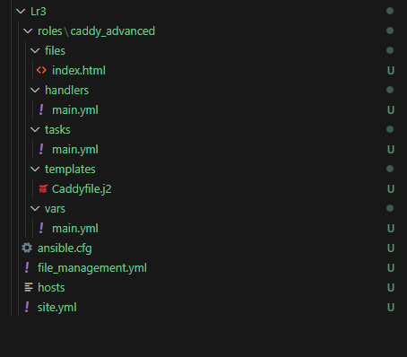
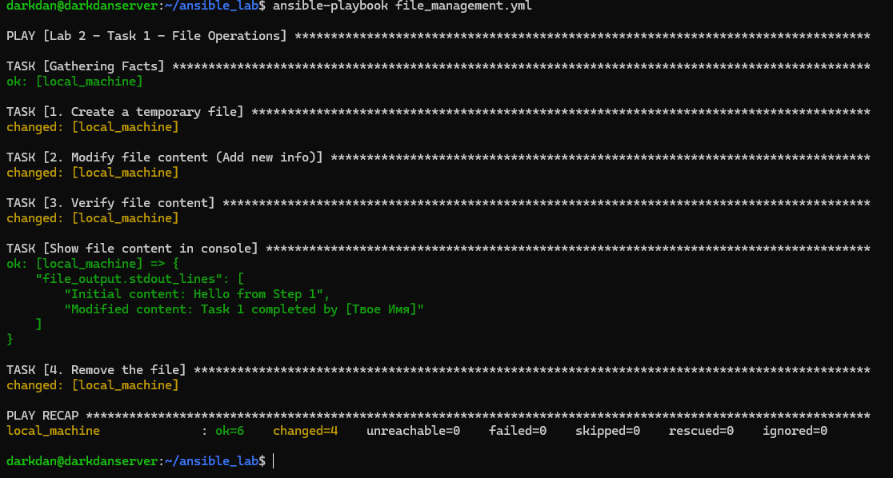
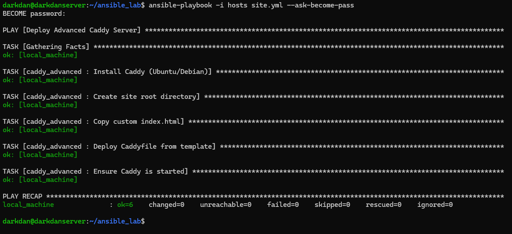
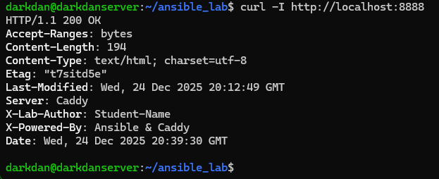
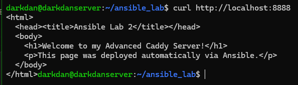
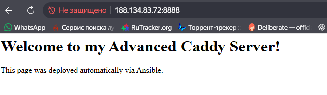

# Отчет по лабораторной работе №3
**Тема:** Автоматизация развертывания веб-сервера Caddy с использованием Ansible

## 1. Настройка окружения
Для выполнения работы была создана структурированная директория проекта. Конфигурация Ansible была вынесена в файл `ansible.cfg`, а целевой хост (`localhost` удаленного сервера) описан в инвентарном файле `hosts`.

**Структура проекта:**

---

## 2. Выполнение задания №1: Работа с файлами
Первым этапом ad-hoc команды из первой части лабораторной работы были переписаны в формат плейбука `file_management.yml`. 

Сценарий выполняет:
1. Создание временного файла.
2. Модификацию его содержимого (добавление строки).
3. Верификацию содержимого и вывод его в консоль через модуль `debug`.
4. Удаление файла.

**Запуск плейбука:**

ansible-playbook -i hosts file_management.yml

## 3. Выполнение задания №2: Развертывание Caddy через роли
Для развертывания веб-сервера была разработана роль caddy_advanced. Это позволяет разделить логику установки, переменные и конфигурационные файлы.

### 3.1. Конфигурация через шаблоны (Jinja2)
Вместо копирования статичного файла был использован шаблон Caddyfile.j2. Это позволило динамически подставлять порт и кастомные HTTP-заголовки.
В ходе работы был выбран порт 8888, чтобы избежать конфликтов с уже запущенными системными процессами на порту 8080.
Кастомные заголовки в шаблоне:
X-Lab-Author: Идентификация студента.
X-Powered-By: Указание стека технологий.
### 3.2. Деплой сайта
Плейбук автоматически создает корневую директорию сайта /var/www/my_site и копирует туда кастомную страницу index.html.

## 4. Проверка результатов работы
Для верификации корректности настройки использовалась команда curl.
### 4.1. Проверка HTTP-заголовков
Команда curl -I подтвердила, что сервер Caddy успешно запущен на порту 8888 и отдает заданные в Ansible-роли заголовки.

### 4.2. Проверка контента
Команда curl без флагов подтвердила, что сервер отдает корректное содержимое файла index.html.

Вывод

В ходе выполнения лабораторной работы были освоены принципы создания Ansible-ролей и работа с шаблонами Jinja2. Использование автоматизации позволило оперативно решить проблему конфликта портов путем изменения одной переменной, что подтверждает эффективность подхода "Infrastructure as Code" (IaC) по сравнению с ручной настройкой сервера. Сервер Caddy успешно развернут, настроен и выполняет функции по отдаче статического контента с кастомными метаданными.